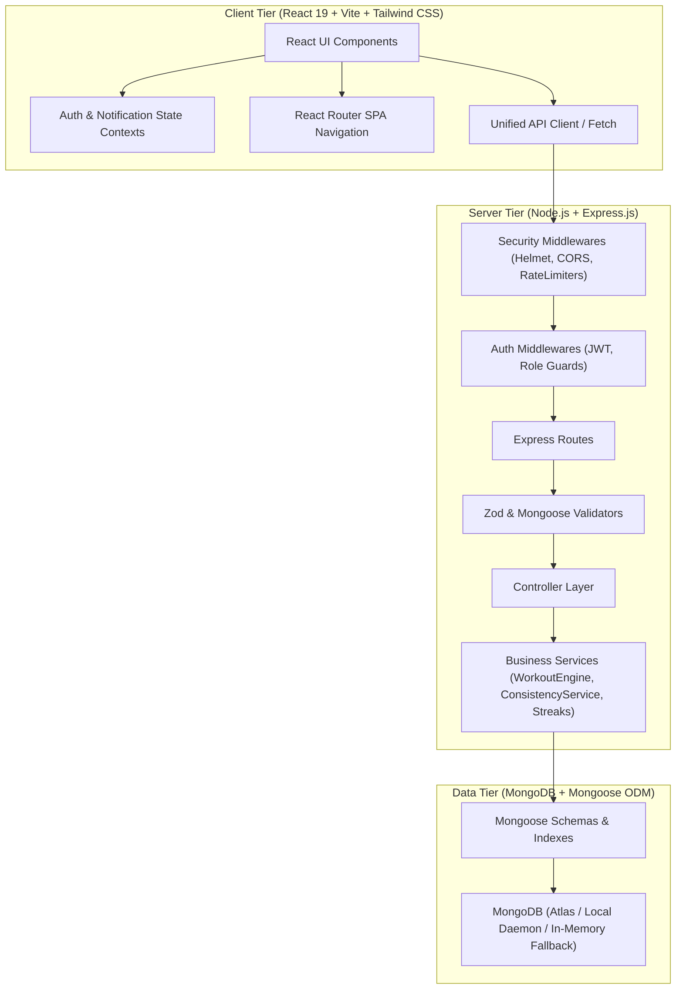
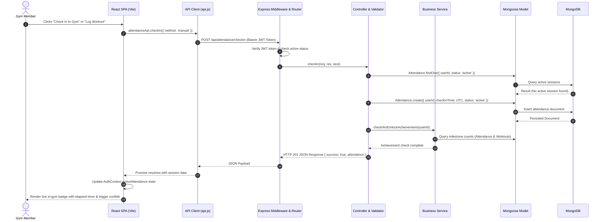

# FitPulse System Architecture & Data Flow

FitPulse is a full-stack Personalized Gym & Fitness Consistency Management Platform built with React, Vite, Tailwind CSS, Node.js, Express, and MongoDB.

## 1. High-Level Architecture Overview

FitPulse employs a decoupled single-page application (SPA) architecture with an Express.js REST API backend and a MongoDB database layer with Mongoose ODM.

---

## 2. End-to-End User Journey & Data Flow

A user interaction (such as checking into the gym, completing a workout set, or updating a profile) travels through seven clearly separated layers:

---

## 3. Core Engine Mechanics

### A. Deterministic Rules-Based Workout Plan Generator
- Eliminates AI hallucinations and medical claims by strictly deriving weekly splits from:
  1. **Fitness Goal**: `muscle_gain` (Hypertrophy 8-12 reps), `strength` (Compound 4-6 reps), `fat_loss` (Conditioning 12-15 reps), `endurance`, or `general_fitness`.
  2. **Experience Tier**: `beginner`, `intermediate`, `advanced`.
  3. **Weekly Schedule**: 1 to 7 planned days.
- Maps biomechanically balanced routines (Full Body A/B for 1-2 days, Push/Pull/Legs for 3-5 days, Upper/Lower for 4 days).
- Injects form cues, precautions, and set/rep targets.

### B. Transparent Consistency Engine
- Does not assume every member trains 7 days a week.
- Formula respects member's selected planned weekly days, calendar duration, and gym opening hours.
- Formula:
  $$\text{Planned Days} = \text{Target Days/Week} \times \left(\frac{\text{Period Days}}{7}\right)$$
  $$\text{Eligible Days} = \min(\text{Planned Days}, \text{Gym Open Days})$$
  $$\text{Attendance Consistency} = \min\left(\text{round}\left(\frac{\text{Actual Attended}}{\text{Eligible Days}} \times 100\right), 100\%\right)$$
- Extra visits beyond target are reported transparently as **Bonus Extra Visits**, avoiding percentages exceeding 100%.

### C. Zero-Config Database Resilience
- If `MONGODB_URI` is provided (e.g. MongoDB Atlas or local MongoDB), the application connects seamlessly.
- If no external URI is provided, the backend automatically initializes an embedded MongoDB engine (`mongodb-memory-server`), ensuring the app runs out-of-the-box without requiring pre-installed system daemons.
